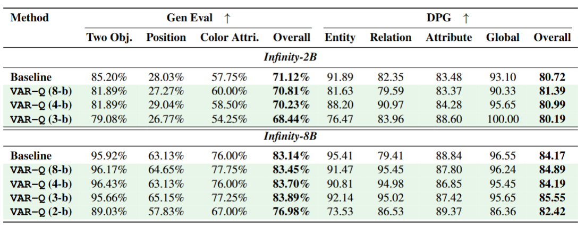
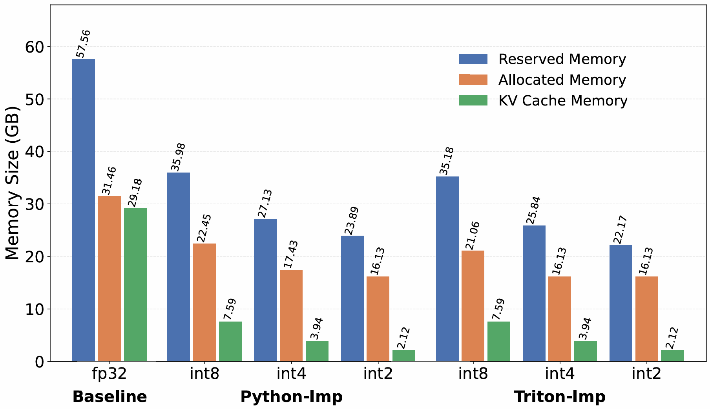
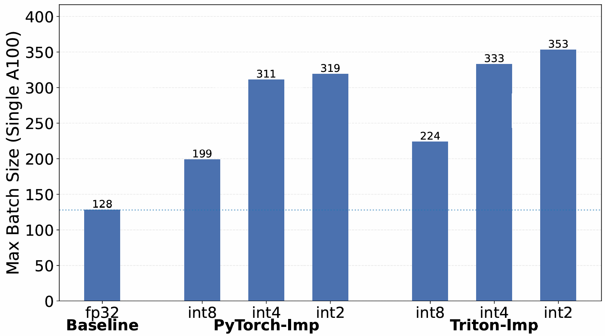

# VAR-Q: Unified Quantization for Visual Autoregressive Models

VAR-Q (Visual Autoregressive Quantization) is an efficient and flexible quantization framework for Vision‑Autoregressive (VAR) and related transformer models. 
It targets KV cache reduction and inference acceleration, while keeping generation quality stable. The framework supports per‑head, per‑dim, per-scale and our unique grouping strategy--per-scale+per-feature.

---

## ✨ Features

- Multiple quant rules: `per-tensor`, `per-scale`, `per-head`, `per-dim`, `VAR_Q(per-scale+per-feature)`.
- Low‑bit packing: built‑in (PyTorch/Triton) INT8/4/3/2 packing & unpacking utilities.
- Plug‑and‑play: drop into existing VAR-style model for PTQ-style quant.

---

## 📁 Repository Structure

```
VAR-Q/
├── Benchmark/                         # Benchmarks for VAR & Infinity (multiple metrics/tools)
│   ├── DPG/
│   ├── GenEval/
│   ├── ImageReward/
│   └── OpenAI-tool/
├── Infinity/                          # Upstream Infinity (adapted for VAR-Q integration)
├── VAR/                               # Upstream VAR (adapted for VAR-Q integration)
├── VAR_Q/                             # Core library (quant ops, pack/unpack, helpers)
│   ├── Infinity-VAR_Q-8.json
│   ├── VAR-VAR_Q-8.json
│   ├── VAR-raw.json
│   ├── __init__.py
│   ├── config_loader.py
│   ├── pack_unpack.py
│   └── quant.py
├── scripts/                           # Shell entrypoints (quick-start & benchmark .sh)
│   ├── eval_Infinity.sh               # Run Infinity benchmarks
│   ├── eval_VAR.sh                    # Run VAR benchmarks
│   ├── inference_multi_VAR.py         # Generate multi-class images with VAR
│   ├── inference_multi_VAR.sh         # Fast multi-class generation with VAR
│   ├── inference_single_Infinity.ipynb# Single-image generation with Infinity
│   └── inference_single_VAR.ipynb     # Single-image generation with VAR
└── README.md
```

> Notes:
> - Use `VAR_Q/` as your import root when integrating in Python.


---

## ⚙️ Installation

### Create a clean environment

We recommend a single, pinned environment to avoid version drift (CUDA/Torch/Triton consistent across all modules):

```bash
conda create -n varq python=3.10 -y
conda activate varq
pip install -r requirements.txt
pip install flash_attn
```

> Keep CUDA/Torch versions aligned with the environment you created in step 1.

---

## Quick Start

### fast inference with a VAR/Infinity pipeline
VAR: `inference_single_VAR.ipynb`  
Infinity: `inference_single_Infinity.ipynb`

### generate multiple classes of images using VAR
```bash
bash scripts/inference_multi_VAR.sh
```
---

## Benchmarking

All benchmarking is provided as shell entrypoints under `scripts/`:

```bash
# VAR benchmarking
bash scripts/eval_VAR.sh

# Infinity benchmarking
bash scripts/eval_Infinity.sh
```
---
## Implementing VAR_Q
### Configurations of VAR_Q
For VAR:
In `VAR_Q/VAR-VAR_Q-8.json`:  
```jsonc
  "quantization": {
    "enable": true,          # Turn on/off Quantization
    "q_bits": 8,             # Set quantization bits
    "quant_method": "G_SCALE_HEAD_DIM", # Quantization strategy
    "qkv_format": "BLHc"     # Fitting the model you use
  }
```
For Infinity:
In `VAR_Q/Infinity-VAR_Q-8.json`:
```jsonc
  "quantization": {
    "enable": true,          # Turn on/off Quantization
    "q_bits": 8,             # Set quantization bits
    "quant_method": "G_SCALE_HEAD_DIM", # Quantization strategy
    "qkv_format": "BHLc"     # Fitting the model you use
  }
```
`enable` controls whether to use VAR-Q method,  
`q_bits` sets the quantization bits, can be 8/4/3/2,  
`quant_method` is how to group the tensors, see `Grouping strategy`,  
`qkv_format` tells VAR-Q the arrange of dimensions of KV tensors in your model.
### Grouping strategy:

`G_TENSOR` treat the entire tensor as a single unit.
This results in only one global scaling factor for all Q/K/V values.  
`G_SCALE_HEAD_DIM` quantize each K/V tensor per scale and per feature(head+head dimension), which is our VAR_Q methods.  
`G_HEAD_DIM` quantize along the head and dimension axes. This produces H × c groups (e.g., 20 × 64 for VAR).  
`G_SCALE` group tensors by scale.
`G_TOKEN` group tensors along the token axis **L**, equals to sequence length. For VAR, this results in 680 or 2240 groups (depending on configuration).
`G_TOKEN_HEAD` group tensors by both token and head dimensions. This yields L × H groups (e.g., 680 × 20 for VAR).

## Results
<p align="center">
  
</p>
<p align="center"><em>Figure 1. Performance of Infinity with VAR-Q.</em></p>


On Infinity-2B, VAR-Q maintains high generation quality down to 4-bit precision. Furthermore, on Infinity-8B, VAR-Q achieves an even stronger result: 3-bit quantization leads to a slight improvement in generation quality, demonstrating its effectiveness.A very aggresive 2 bits quantization just has 7% performance drop.


<p align="center">
  
</p>
<p align="center"><em>Figure 2. Performance of Infinity with VAR-Q.</em></p>
The customized Triton-based int2 implementation achieves a 93.1% reduction in KV cache memory, 56.9% reduction in allocated memory, and 61.4% reduction in reserved memory compared to the fp32 baseline on a single Nvidia A100 GPU. 
The total memory footprint is reduced from 57.46GB to 22.17 GB at the same batch size of 128, highlighting the extreme memory efficiency of VAR-Q.


<p align="center">
  
</p>
<p align="center"><em>Figure 3. Performance of Infinity with VAR-Q.</em></p>

## License

MIT License (see `LICENSE`).

---

## Contact

Author: Jiaji Lu, Boxun Xu  
Affiliation: Peng Li's lab, ECE, UCSB

⭐ If you find VAR‑Q useful, please give it a star! ⭐